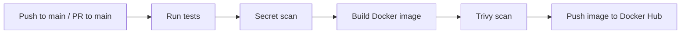

# CI/CD Pipeline Demo

Production-grade CI/CD pipeline built with **GitHub Actions**, **Docker**, and **security scanning** — demonstrating best practices for automated testing, containerization, and deployment.

**GitHub Actions Status:** [](https://github.com/maciekmazurek/CI-CD-demo/actions)

---

## Project Overview

This project implements a complete CI/CD pipeline for a Python FastAPI application, showcasing modern practices including:

- **Automated Testing** - pytest with HTTP client
- **Secret Scanning** - TruffleHog for credential detection
- **Container Security** - Trivy vulnerability scanning
- **Docker Build & Push** - Automated image building and registry push
- **Multi-stage Workflow** - Test → Build → Scan → Push

## Workflow Diagram



---

## Configuration

### GitHub Secrets Required

Set these secrets in your repository settings (Settings → Secrets and variables → Actions):

```
DOCKER_USERNAME    → Your Docker Hub username
DOCKER_TOKEN       → Your Docker Hub access token
```

### Trigger Conditions

Pipeline runs automatically on:
- Push to `main` branch
- Pull requests targeting `main` branch

---

## Stack

- **Language:** Python 3.12
- **Framework:** FastAPI
- **API Server:** Uvicorn
- **Container:** Docker
- **CI/CD:** GitHub Actions
- **Security:** Trivy, TruffleHog
- **Testing:** pytest
- **Registry:** Docker Hub

---

## Pipeline Details

### Test Job
- Checks out code
- Sets up Python 3.12
- Installs dependencies from `requirements.txt`
- Runs unit tests with pytest
- Performs secret scanning (blocks on verified secrets)

### Build Job
- Triggers only after test job succeeds
- Logs into Docker Hub
- Builds Docker image
- Scans image with Trivy (blocks on HIGH/CRITICAL vulnerabilities)
- Pushes image to Docker Hub with `latest` tag

---